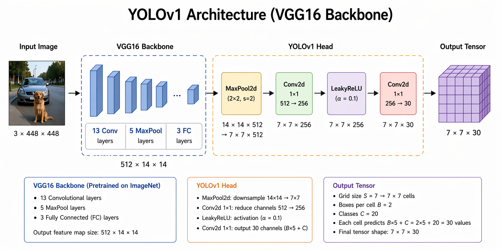
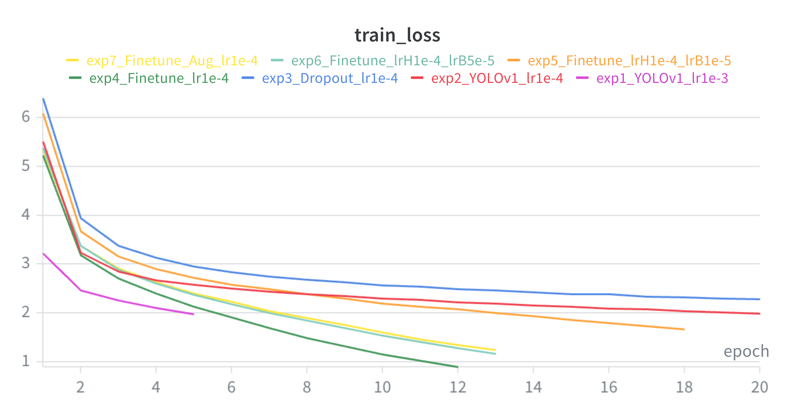
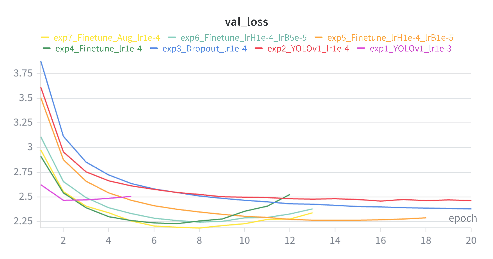
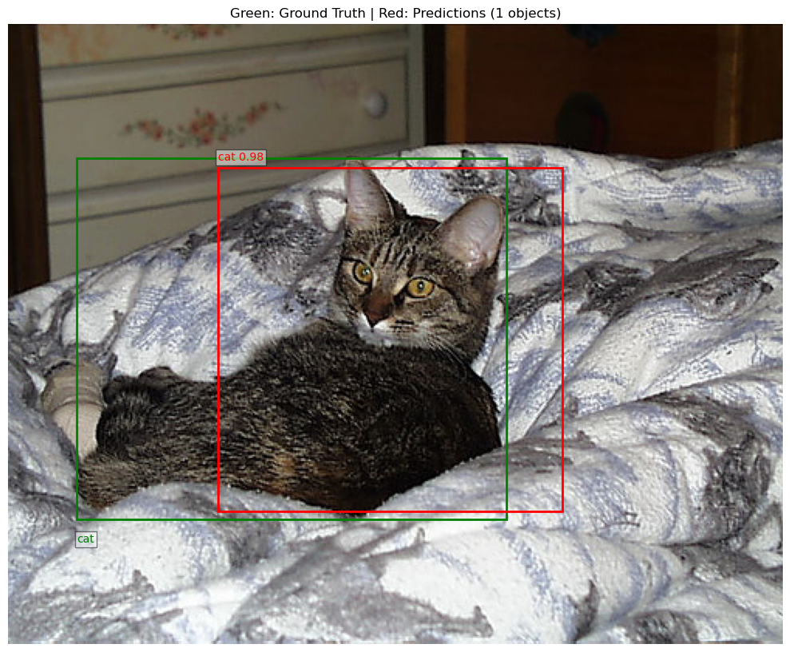
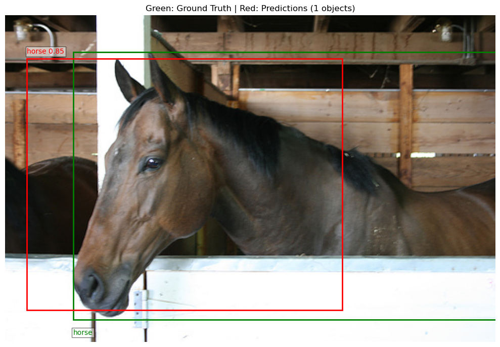
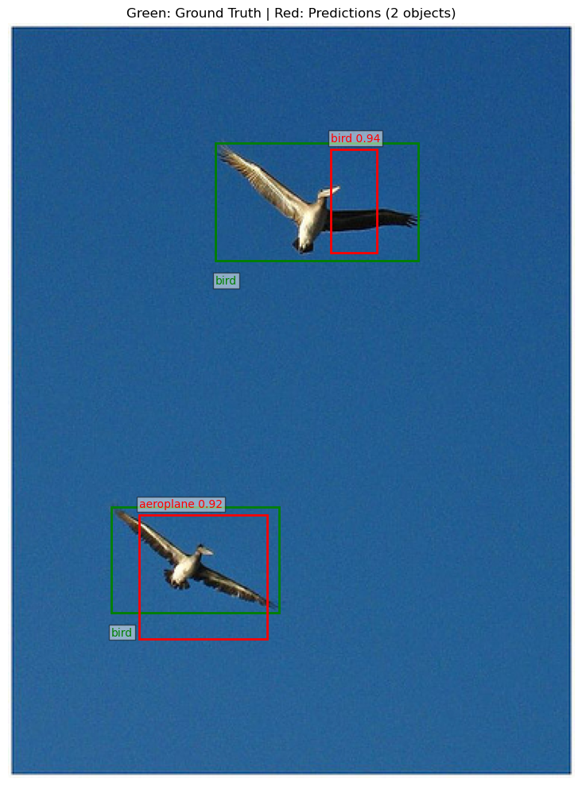

# YOLO Object Detection on Pascal VOC 2012


## Project Overview
Implementation of a YOLOv1-style object detection model using a pretrained VGG16 backbone, trained and evaluated on the Pascal VOC 2012 dataset with 20 object categories.

**Course:** INM705 Deep Learning for Image Analysis  
**Institution:** City St George's, University of London  
**Authors:** Bo Fu, Yehoshua Perez Condori  

---

## Model Architecture

YOLOv1-style detector using a pretrained VGG16 backbone and lightweight detection head.

<p align="center">
  
</p>

<p align="center">
  <em>Figure 1. YOLOv1-style object detector with VGG16 backbone and prediction head producing a 7×7×30 output tensor.</em>
</p>

---

## Links
- **Wandb:** https://wandb.ai/bofu001-/YOLO-VOC2012
- **Colab Notebook:** https://drive.google.com/file/d/182m9Fadqzu_SJAwi9HJrPFqUUiMgEdhU/view?usp=sharing
- **Kaggle Notebook:** https://www.kaggle.com/code/bofu001/yolo-object-detection
- **Dataset:** https://www.kaggle.com/datasets/huanghanchina/pascal-voc-2012

---

## Project Structure
```bash
coursework/
├── config.py                        # paths, device, seed, classes
├── requirements.txt                 # dependencies
├── YOLO-object-detection.ipynb      # main notebook
├── checkpoints/                     # saved model weights
│   ├── exp1_YOLOv1_lr1e-3.pth
│   ├── exp2_YOLOv1_lr1e-4.pth
│   ├── exp3_Dropout_lr1e-4.pth
│   ├── exp4_Finetune_lr1e-4.pth
│   ├── exp5_Finetune_lrH1e-4_lrB1e-5.pth
│   ├── exp6_Finetune_lrH1e-4_lrB5e-5.pth
│   └── exp7_Finetune_Aug_lr1e-4.pth
└── modules/
    ├── Dataset.py                   # VOCDataset, data augmentation, dataloaders
    ├── Loss.py                      # YOLOv1 loss function
    ├── Train.py                     # training loop (no early stopping)
    ├── TrainFinetune.py             # training loop with early stopping
    ├── TrainFinetuneLayerwise.py    # training loop with layer-wise LR + early stopping
    ├── Evaluation.py                # mAP evaluation
    ├── Inference.py                 # inference and visualisation
    └── Models/
        ├── YOLOv1.py               # frozen VGG16 backbone + head
        ├── YOLOv1Dropout.py        # frozen VGG16 + dropout in head
        └── YOLOv1Finetune.py       # unfrozen last 2 VGG16 layers + dropout
```

---

## Dataset

**Pascal VOC 2012** - 20 object categories, 11,540 images.

Download from Kaggle:
```bash
kaggle datasets download -d huanghanchina/pascal-voc-2012
```

Place the dataset in:
```bash
coursework/data/VOC2012/
├── JPEGImages/
├── Annotations/
└── ImageSets/Main/
    ├── train.txt
    └── val.txt
```

---

## Setup

```bash
pip install -r requirements.txt
```

---

## Training

Primary training workflow is provided in YOLO-object-detection.ipynb and can be executed locally or on Colab/Kaggle.

### Experiments

| Experiment | Model | LR | Notes | Best Val Loss | mAP@0.50 | mAP@0.50:0.95 |
|-----------|-------|----|-------|---------------|----------|---------------|
| exp1 | YOLOv1 | 1e-3 | Baseline, 5 epochs | 2.4655 | 0.1048 | 0.0221 |
| exp2 | YOLOv1 | 1e-4 | Lower LR, 20 epochs | 2.4579 | 0.0961 | 0.0204 |
| exp3 | YOLOv1Dropout | 1e-4 | Dropout p=0.5 | 2.3808 | 0.0935 | 0.0200 |
| exp4 | YOLOv1Finetune | 1e-4 | Unfreeze last 2 VGG layers + ES | 2.2294 | 0.1208 | 0.0284 |
| exp5 | YOLOv1Finetune | lrH=1e-4, lrB=1e-5 | Layer-wise LR + ES | 2.2649 | 0.1116 | 0.0245 |
| exp6 | YOLOv1Finetune | lrH=1e-4, lrB=5e-5 | Layer-wise LR tuning + ES | 2.2452 | **0.1304** | **0.0284** |
| exp7 | YOLOv1Finetune | 1e-4 | ColorJitter augmentation + ES | 2.1851 | 0.1274 | 0.0272 |

**Best model: exp6** (mAP@0.50 = 0.1304)

---

## Evaluation

Evaluation uses torchmetrics.detection.MeanAveragePrecision:

- **mAP@0.50**: IoU threshold = 0.50
- **mAP@0.50:0.95**: IoU thresholds from 0.50 to 0.95

---

## Training Curves

Training and validation loss curves were logged using Weights & Biases across all seven experiments.

<p align="center">
  
</p>
<p align="center">
  <em>Figure 2a. Training loss curves across all experiments.</em>
</p>

<p align="center">
  
</p>
<p align="center">
  <em>Figure 2b. Validation loss curves showing early stopping behaviour in fine-tuning experiments.</em>
</p>

The curves show consistent optimisation progress, while experiments 4–7 demonstrate clear overfitting control through early stopping.

---

## Inference Examples

The best-performing checkpoint (**exp6**) is loaded in the final notebook cell and evaluated on held-out test images.  
Ground truth bounding boxes are shown in **green**, while model predictions are shown in **red** with confidence scores.

<p align="center">
  
</p>
<p align="center">
  <em>Figure 3a. Accurate cat detection with high confidence (0.98).</em>
</p>

<p align="center">
  
</p>
<p align="center">
  <em>Figure 3b. Correct horse localisation with confidence score 0.85.</em>
</p>

<p align="center">
  
</p>
<p align="center">
  <em>Figure 3c. Small-object failure case: one bird detected correctly, another misclassified as aeroplane.</em>
</p>

These examples show that the model performs well on large and visually distinctive objects, while performance is weaker for small or ambiguous targets.

---

## Reproducibility

- Random seed fixed at 42
- Val/Test split uses fixed Subset indexing (no random_split)
- torch.backends.cudnn.deterministic = True

---

## Platform Support

config.py automatically detects the environment:

| Platform | Data Path | Checkpoint Path |
|----------|-----------|-----------------|
| Local | data/VOC2012/ | checkpoints/ |
| Kaggle | /kaggle/input/ | /kaggle/working/ |
| Colab  | Google Drive | Google Drive |

---

## Summary

This coursework demonstrates a reproducible YOLOv1-style object detection workflow using transfer learning, structured experimentation, and systematic evaluation under realistic computational constraints.